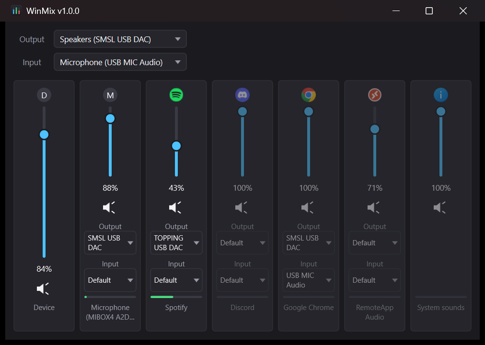

# WinMix

A lightweight Windows tray utility for **per-application** audio control — a
volume mixer, built as a native, dependency-free `WinMix.exe`.

WinMix sits in the system tray and gives you a compact mixer window: an
independent volume slider, mute button, and peak meter for every app currently
playing audio, plus quick pickers for the system's default playback and
recording (microphone) devices — all without leaving the tray.



## Why

Switching which speakers or microphone an app uses is buried a few clicks
deep in Windows — Settings > System > Sound > Volume mixer, or the small
flyout off the taskbar speaker icon — and it only lists an app once it's
already making noise. WinMix was built to make that switch fast and always
one click away from the tray, instead of hunting through Settings every time.

## Features

- Per-app volume sliders, mute, and live peak meters, similar to the native
  Windows volume mixer but always one click away in the tray
- Pin an individual app's audio output to a specific playback device,
  independent of the system default
- Choose a microphone per app, including apps that only record audio;
  use Default to follow Windows' input defaults again
- System-wide output and input (microphone) device pickers, available both in
  the main window and the tray icon's context menu
- Runs quietly in the tray; closing the window hides it rather than exiting —
  use "Exit" in the tray menu to actually quit
- A single native `WinMix.exe` — no .NET runtime, no other dependencies

Apps with multiple audio streams or worker processes share one volume control.
The control stays in place while Windows recreates streams during an output
switch. Device pickers read the saved Windows preference, including changes
made outside WinMix; an unavailable pinned device is shown explicitly.
App device pickers automatically shorten generic Windows names, wrap them onto
two lines, and keep custom names and distinguishing details. Hover for the full
device name; the dropdown lists full names and marks the current selection.
Each app has labeled Output and Input pickers. Input selection applies to voice
calls as well as normal recording and does not change the system microphone or
playback settings. Recording-only apps show "Input only" instead of playback
volume controls. Apps with their own microphone selection need to use System
Default; some apps apply changes when recording restarts.
If an app keeps playing through another device after a switch, WinMix explains
how to let Windows control its output. In Spotify, choose **System Default** in
**Settings > Playback > Audio output > Device**; selecting a DAC inside Spotify
overrides Windows' per-app output preference.

## Requirements

- Windows 10 (build 20348 or later) or Windows 11
- To build: Visual Studio Build Tools 2022, "Desktop development with C++"
  workload, plus the "C++ CMake tools for Windows" optional component (this
  bundles the CMake/Ninja used below — no separate install needed)

## Building

```powershell
cmake --build --preset x64-debug
```

Both `WinMix.Audio` and `WinMix.App` build with warnings treated as errors,
so a clean build means a clean build.

If `cmake` isn't on `PATH`, add the VS Build Tools' bundled copy first:

```powershell
$env:PATH += ";C:\Program Files (x86)\Microsoft Visual Studio\2022\BuildTools\Common7\IDE\CommonExtensions\Microsoft\CMake\CMake\bin;C:\Program Files (x86)\Microsoft Visual Studio\2022\BuildTools\Common7\IDE\CommonExtensions\Microsoft\CMake\Ninja"
```

## Running

```powershell
build\x64-debug\WinMix.App\Debug\WinMix.exe
```

WinMix only allows a single running instance — launching a second copy while
one is already running silently exits, so you won't see your changes. If
you're not sure one isn't already running, close it first:

```powershell
Stop-Process -Name WinMix -Force -ErrorAction SilentlyContinue
```

## Testing

```powershell
build\x64-debug\tests\Debug\winmix_audio_tests.exe

# Run one test case
build\x64-debug\tests\Debug\winmix_audio_tests.exe --test-case="VolumeCurve*"

# Inspect app groups, stream counts, and saved output preferences once
build\x64-debug\tools\AudioSmokeTest\Debug\AudioSmokeTest.exe --once

# Check routing/readback on every output using only the test process;
# restores that process's original preference afterward
build\x64-debug\tools\AudioSmokeTest\Debug\AudioSmokeTest.exe --test-routing

# Check all per-app input roles, reset, and isolation from output preferences
build\x64-debug\tools\AudioSmokeTest\Debug\AudioSmokeTest.exe --test-input-routing

# Verify recording-only app discovery without starting or recording audio
build\x64-debug\tools\AudioSmokeTest\Debug\AudioSmokeTest.exe --test-capture-discovery

# Verify a playing app actually moves (PID and zero-based device index);
# restores its original preference afterward
build\x64-debug\tools\AudioSmokeTest\Debug\AudioSmokeTest.exe --test-app-routing <pid> <device-index>
```

## Producing a release build

```powershell
cmake --build --preset x64-package
```

This produces a fully self-contained, statically-linked `WinMix.exe` under
`build\x64-package\WinMix.App\Release\` with tests and dev tools
excluded from the build graph — no VCRUNTIME/MSVCP/UCRT dependency to
install on the machine that runs it.

## Project layout

- `WinMix.Audio` — all Core Audio / WASAPI interaction, via raw COM
  interop (no third-party audio library). No UI dependencies, so it stays
  independently testable.
- `WinMix.App` — the Win32 + Direct2D/DirectWrite shell: the mixer
  window, custom controls, and tray icon.
- `tests` — doctest tests against `WinMix.Audio`.
- `tools/AudioSmokeTest` — a console tool for verifying the audio
  layer against real playback, independent of the UI.
